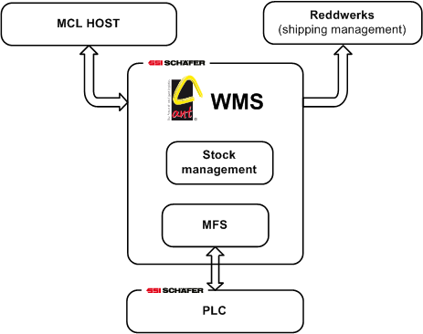
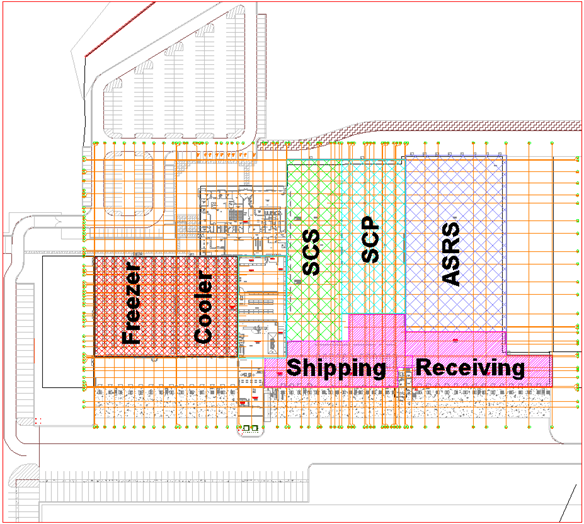

to edit the WIKI see the [read me](ReadMe.md)
# **Ant**

## Functionality

Ant is a system ran by Schaefer that communicates with [MCL HOST](./MCLHOST/MCLHOST.md) and [Reddwerks](./Reddwerks/Reddwerks.md) to automate the regular functions of a warehouse.

These general ***functions*** can be broken down into [Receiving](./Areas/Receiving/Receiving.md)(both a warehouse function and area), [Replenishment](./Replenishment/Replenishment.md), and [Picking/Shipping](./Picking_Shipping/Picking_Shipping.md).

General ***functions*** are facilitated by the subfunctions [Storage](./Storage/Storage.md) and [Retrieval](./Retrieval/Retrieval.md). Example: [Replenishment](./Replenishment/Replenishment.md) for [SCP](./Areas/SCP/SCP.md) requires that there is a [retrieval](./Retrieval/Retrieval.md) order for stock on a pallet in [HBW(ASRS)](./Areas/HBW.md) to come to [De-Layering](./Areas/SCP/De-Layering/De-Layering.md) and that a [storage](./Storage/Storage.md) order later tells that tray with De-layered stock to go to a [SCP](./Areas/SCP/SCP.md) storage location.

General ***functions*** can require **Areas** with specific equipment and services to specialize in one function. These **Areas** made to fit specific ***functions*** can be divided into..

| Area      | Function | Function : Subfunction breakdown
| ----------- | ----------- |---------|
| SCP      | Picking/Shipping   Replenishment (De-Layering)  |  - Retrieving Cases (Picking) - Storing Cases (Replenishment)
| SCS      | Picking/Shipping   Replenishment (De-Trash)      |  - Retrieving Inners (Picking)  -  Storing Inners (Replenishment)
| ASRS (HBW)      | Receiving   Picking/Shipping (only with shipper pallets)   Replenishment (De-Trash or De-Layering)      | - Storing Pallets (Receiving)   - Retrieving Shipper Pallets (Picking)   - Retrieving Pallets (Replenishment) 
| Shipping      | Picking/Shipping       |  N/A?
| Receiving      | Receiving       |    N/A?

 

 

## System Breakdown

Ant can be divided into the subsystems [WMS](./WMS/WMS.md), [MFS](./MFS/MFS.md), and [PLC](./PLC/PLC.md). These systems work across every **Area** with area-specific services.

[WMS](./WMS/WMS.md) (Warehouse Management System) governs Ant at a high level, processing logic behind Ant's core functionality of Receiving, Storage, Replenishment, and Retrieval. It keeps track of data on stock and also creates orders about what should be done with stock.

- (mention that wms and mfs are linked through transport unit and load unit.)

[MFS](./MFS/MFS.md) acts as an intermediary between WMS and PLC. While MFS has more specific control than WMS it has no awareness of stock. Instead MFS interprets all stock that is literally moving on conveyors as generic objects like totes, tubs, trays, cases, and pallets. MFS moves these generic object's according to their transport order.  

[PLC](./PLC/PLC.md) has the most precise control on movement. "WMS drives MFS and MFS drives PLC"

# Links
- [MCL HOST](./MCLHOST/MCLHOST.md)
- [Reddwerks](./Reddwerks/Reddwerks.md)
- [Receiving](./Receiving/Receiving.md)
- [Storage](./Storage/Storage.md)
- [Replenishment](./Replenishment/Replenishment.md)
- [Retrieval](./Retrieval/Retrieval.md)
- [WMS](./WMS/WMS.md)
- [MFS](./MFS/MFS.md)
- [PLC](./PLC/PLC.md)
- [Picking/Shipping](./Picking_Shipping/Picking_Shipping.md)