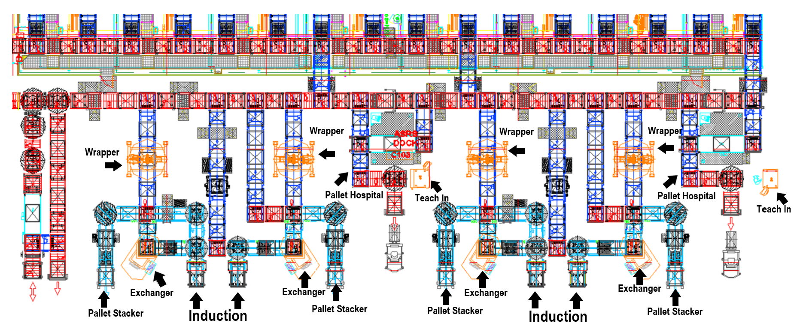

# [ANT](/ANTWIKI.md)>Receiving(Area)

(also see [Receiving(Process)](/Receiving/Receiving.md))

The Receiving Aea (F01 in VISU) is used to unload trucks arriving to the warehouse with stock.

Sub-areas and workstations include (maybe include location)

|Notable Locations|location|function|
|-|-|-|
|Pallet loop|N/A|Moves Pallets for ANT, Pallets flow counter clockwise|
|Teach In Stations|N/A|Allows operator to create new Materials|
|Wrappers|*PRS01DP01*, *PRS01DP03*, *PRS02DP01*, *PRS02DP03*|Wraps Pallets in plastic, Moves Pallets sheet|
|Pallet Stacker||Takes and distributes System Pallets (to what? a forklift?)|
|Exchanger|*PRS01PX01*, *PRS01PX02*, *PRS02PX01*, *PRS02PX02*|Moves Stock from Vendor Pallet to System Pallet|
|Induction Point|*PRS01SR01*, *PRS01SR02*, *PRS02SR01*, *PRS02SR02*|Accepts a Vendor_Pallet of Stock into the system in Receiving(Process) (are there actually 4 or are 2 of these for exit only?)|
|Pallet Hospital|*PNO01WP01*, *PNO02WP01*, *PNO01RP01(exit)*, *PNO02RP01(exit)*|Used to fix unexpected problems with Pallets|

While partially located in Receiving the pallet loop is used outside of the Receiving process for each general function of ant.

(include significant locations of the pallet loop)

(draw the specific locations and also include the general flow of conveyors)

Wrappers

Receiving includes part of the pallet loop which a pallet may be on for processes unrelated to the receiving process like replenishing De-Layering/De-Trash or it could be going to shipping as a shipper pallet. A pallet could also be storing after replenishment is complete. The area is used to move stock involved in many processes other than the Receiving(WarehouseFunction) Process.

processes described in [Receiving(WarehouseFunction)](/Receiving/Receiving.md).

# Links
- [ANT](/ANTWIKI.md)
- [ReceivingFunction](/Receiving/Receiving.md)