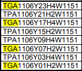

# [ANT](/ANTWIKI.md) \ SCP

SCP is an area made to store and quickly pick cases from trays in storage racks.

Delayering is a subarea of SCP

## **Sub-Areas and Workstations**

|component|Ant location|function|
|-|-|-|
|Mod|Left = Mod 1, Right = Mod 2|SCP has a Mod 1 and Mod 2|
|Side|Left is Side 1 Right is Side 2|6 STSes|
|Storage Rack||Where cases sit|
|Sts's||Reaches any location of it's storage racks to retrieve/store a tray,<br> can pass/get trays from Case Wheelers via TPA/TGA locations|
|TPA/TGA/TRA locations||(TPA/TGA) Locations on the racks used mutually between case wheelers and <br>sts's to send/receive trays of cases. (TRA) Locations used to store Trays.|
|Case Wheelers| *example CWL1151* (1st num = mod)(2nd num = side)(3rd num = 5 (idk))(4rth num = front to back 1 through 6)|Interacts with Sts's via TPA/TGA locations to move trays of product to Outfeed Conveyor.<br> Wheels cases onto Outfeed Conveyor. (6 per side, 24 total)|
|Outfeed Conveyors/Outlet Conveyors|*example CWOC1101* (1st num = mod)(2nd num = level)(3rd & 4th num = order front to back(even = side 1, odd = side 2))|Passes product from Case wheeler to Window Conveyor|
|Window Conveyors|Mod1(1100, 1200, 1300),<br>Mod2(2100,2200,2300)|carries product from Outfeed Conveyors Through OS Stations, Logo Pack, and finally to the Merge Point|
|OS Stations|can't find|Confirms material/article? Orientation and that there is only one case|
|Logo Pack|can't find|Label the cases with barcodes so they can be tracked with scanners across conveyors|
|Merge Point|before split(mod1(BSH11JD0100, BSH12JD0100, BSH13JD0100),mod2(11-13 => 21-23)),<br>merge(mod1(BSH11JM0100, BSH12JM0100, BSH13JM0100, BSH11JM0200, BSH12HM0200, BSH13JM0200)),<br>merge(mod2(11-12 => 21-23)) |Combines totes and cases of a stop.<br> What is the part that splits cases onto their door from their sister door called.<br> Is that apart of the merge point?|

Top Down view of SCP
- blue doted line is division between mod 1 and 2
- green outline is window conveyor (3 levels per mod), also acts as division between sides (2 sides per mod)
- red outlined conveyors are outfeed conveyors(3 levels, same as wc).
- blue labeled squares, like TL####, are case Wheelers.
- empty white vertical rows are were the STS's sit.
- small cells surrounding STS track is storage.


Visu (side view) of SCP

- The horizontal rectangles are STS's (6 per side)
- The Vertical rectangles are CaseWheelers (6 per side, extras are replenishment lifts)
- Conveyors you see at the top are the window conveyors (3 per mod)
- Bottom right is Delayering (sub area of SCP)


<br>

# **Sub Areas and Equipment Continued**
## **Rack**
Metal Frame containing many storage spaces for trays (tra locations) and (TGA/TPA) locations for passing them between case wheelers. Racks also include an empty isle within themselves for an STS to travel.


#### **TRA locations**

*Example taken from ant*\


TRA - denotes a storage location.\
1206 - the sts associated to a rack, 3rd digit is always 0 for the rack.\
X006 - horizontal position on rack\
Y01 - vertical position on rack\
Z11 - side

Y columns can't just go from 1-26, these positions need to account for the height of product. This is done with height classes. Because of height classes the y locations for most TRA locations are 01, 03, 05, 07, 09, 15, 17, 19, 21, 24

#### **TPA/TGA locations**

*Example taken from ant*\


TPA/TGA - denotes a put/get location.\
1106 - the sts associated to the rack. 3rd digit always 0.\
Y03 - y position, see all y positions below.\
H4 - height class
W1151 - Case Wheeler

Columns on the rack beside a case wheeler are used as transfer points instead of storage. Their Y locations are 01, 03, 07, 09, 15, 17, 21, and 23.

TPA = Transfer Put Aisle\
STS can only **PUT** a tray in this location, a case wheeler can grab a tray from here.


TGA = Transfer Get Aisle\
STS can only **GET** a tray in this location, a case wheeler can place a tray here.




## **STS's**
 - Naming conventions on STS's and forks, how far can forks reach
 STS's in material flow
 - start with TS
 - name of STS 3rd digit is 1
 - fork position as FP

 these are material flow points

## **Case Wheelers**
 - Naming conventions, sub component breakdown

<br>

# **To add**
Tray Hospital 1 - TDL01WP01
Tray Hospital 2 - TDL02WP01
A place that talks about the distinction between locations in MFS and WMS. (especially important with locks) but not on this page
OS stations.
OS stations dialog.
Controllers.


## **Problem: double allocation**
### **Problem description** 
- door stops working
- crashed CPAISArea2110 controller for that window conveyor. 
- exception on controller "Found more than one case for one allocation at location CPAOS2110: [case barcode date, case barcode date]"

### **Solution: use "Book case to NOK" button on case not physically in OS**
1.  Of the cases listed in the exception identify which is in the OS station through the "Orientation Station Overview" or an OS Operator.
2.  Find that material in the "Window Conveyer Overview"
3.  Book the **OTHER** material to NOK using "Book case to NOK" button.

|Visually identify material in "Orientation Station Overview"|Find material in "Window Conveyor Overview" and use "Book case to NOK" on other material|
|-|-|
|||

Lastly restart OS station.

<br>

## **Problem: Physical and Logical conflict on outfeed**
### **Problem description**
- door stops working
- case visualization different from VISU logic physical disconnect book 
### **Solution: Book Problem Case to Window Conveyor**
Book case to window conveyor in case visualization.
Then make sure the case makes it onto the window conveyor physically.

<br>

## **Problem: No Button on OS Station**
### **Problem description**
- no buttons on os station
### **Solution:**
-Clean up Case Request/data for SCP

Use when operator confirms a manual handling for more cases than should have been confirmed.
The cases will show as a "Wheeled Too Much" but will not have F9-Remove Case option available.
Missing Case does not remove the case from the line up.

1. From Window Conveyor Overview
    - Get the Order ID number
    - Get the Sequence number from the Details box on the side
2. Pack Order Overview
    - Search by: Order ID number
    - Go to the bottom of the lower window and look for the sequence numbers
    - Highlight each number and choose 'Cleanup Case Request' button at the top

<br>

#### ***OR/AND***
                
***If Wheel too Much With no Buttons in OS Station.***

Run query on PRD: 

```sql
select os.rowid, os.* from cpaossituation os;
```


- in the query results: Lines 1 = OS11, 2 = OS12, 3 = OS13,  4 = OS21 5= OS22  6 = OS23
- (select rowid allows editing)
- Look at Columns DRT_Dialogrequestid, DRT_RequestTime, DRT_ResolveTime, DRT_VerificationError, and VisionImagePath for the OS with the issue.
- Delete only the data that is in the columns of the OS with the issue. 
- Where there is no data for the other OS's.  
- When Deleting : 
    - Unlock, delete data with requirements from above, Green Check Mark, Lock, then Commit
- May have to push the case back and let it re-enter the OS to completely fix it.

<br>

 ### ***When First Solution Doesn't Work***

- ***If Case Before OS Run:***
```sql
select r.rowid, 
    r.sequencenumber
FROM scmcaserequest r
WHERE sequencenumber = '2260' -- 2507
AND pickedcase_id = 1623318807755;
```

so I used this to find the duplicate sequence within the case request dialog. 
TO address it I found the one that was supposed to be in the OS and changed it to higher than the highest sequence number for that order

- ***If Case After OS Run:***
```sql
select r.rowid, 
    r.sequencenumber, r.*
FROM spmcaserequest r
    where r.sequencenumber = '105'
    order by r.packorder_id --look for duplicate pack order id's -- look for X, Y, Z  diminsions to match case  - delete this row
```