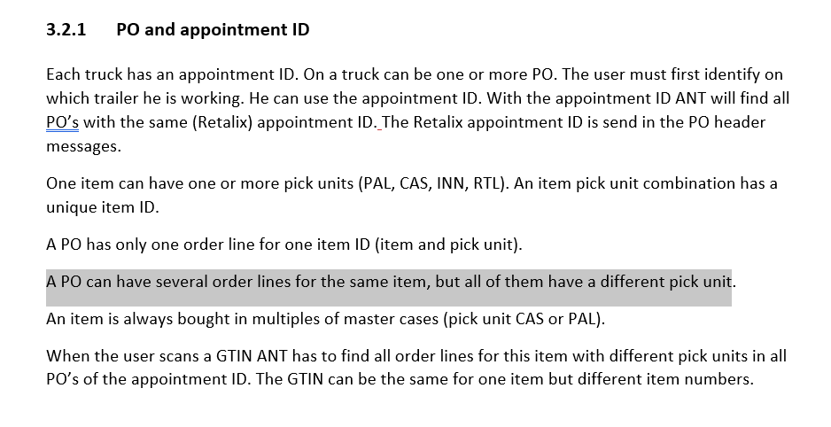

# [ANT](/ANTWIKI.md)>Receiving(Process)

(also see [Receiving(Area)](/Areas/Receiving/Receiving.md))

The **Receiving** process processes and stores stock from trailers at the [Receiving](/Areas/Receiving/Receiving.md) Area. 

# General Receiving

## Terms

Each **trailer** has an **Appointment ID** that breaks down into one or more **PurchaseOrders (PO)'s** (usually one).
The **PO's** are represented by **"Receiving Orders"** in **ANT** which act as a parent to **"Receiving Order Lines"** which themselves represent a single **Picking Unit**(vendor pallet).

**Stock** arriving with the same **Item ID** will share a **Receiving Order Line**, there may be one or more ROL's if the amount could not fit on one vendor pallet.

## Statuses
Statuses are used to track the progress of an appointment. The Receiving Statuses are first recorded in the RO's.

1.	New – Data has been received from Retalix.
2.	Assigned – The operator assigns a door to the Appointment ID.
3.	Planned – Stage that the pallets have been created; items are maintained and ready to be received. 
4.	Started – Receiving operators start scanning the pallets/case items.
5.	Finished – Each line item (ROL,COL) changes to Finished status once the operator completes receiving the item. 
6.	Closed – When the load is closed, it does not show in ANT.

 

## General Flow of Receiving with Statuses

- These steps should be separated by their status.

1. ### Host Communication (planning)

                The host sends the data to the onsite database. (include details about POHDR and PODTL)
2. ### New

                The Appointment ID is linked to the Receiving Order whose status begins with new.
                The Receiving Order is also linked to the Receiving Order Lines which show the item and amount that should be received. 
3. ### Assigned

                The receiving clerks assign an appointment gate to the Appointment ID which changes the appointment status to 'Assigned'.
                - Gate 31 is the grocery dock.
                - Gate 10 is the cooler/freezer dock.
4. ### Planned (needs work)

                Once the ROL’s are in ‘Assigned’ status, the system can move to ‘Planned’ status.
5. ### Planned CONT

                ‘Planned’ status creates the Consolidation Order (CO) and Consolidation Order Line (COL). 
                Once the PO is planned the CO decides how many pallets are needed to induct the item.
                The Receivers can start receiving the item after the item reaches the ‘Planned’ status.
6. ### Started/Finished

                When the receiver scans the items, the COL’s change status to ‘Started’.
                When the operator finishes scanning the item the COL changes the status to ‘Finished’.
7. ### Started/Finished CONT

                At the end of the receivers flow, they will scan and assign a vendor barcode for the pallet.

8. ### Started/Finished CONT
                The vendor barcode attaches the load unit to the stock and creates the storage order for the stock items.

9. ### Finished	
                Once the pallet is placed on the induction line, the vendor barcode is scanned.
                If the pallet is on a Chep pallet, it will need to go to the Pallet Exchanger
                to be exchanged for a system pallet and get the system pallet barcode 
                assigned to the load unit.
10. ### Closed (will see on consolidation orders, rol's will be deleted here)
        The status changes to closed after all the ROL's of a RO are in finished. The appointment is deleted?

*Question: Reading this like one receiving order line represents one pallet, is that right?* - no, receiving does not give a rol to each pick unit, only a unique pick unit item combination. All pallets with one stock item will be the same. But different from The same item On a case.

Received goods are available for replenishment but are not reserved for shipping (billing) until the corresponding PO is closed and the stock is confirmed to McLane. 

                "When a truck arrives the receiving office must update the status of the appointment ID (start the appointment ID), so that the receiver with the RF terminal find the appointment ID faster and must not scroll through all appointment IDs. At the same time a gate is assigned for the appointment (trailer). A menu used to start the appointment is designed on RF terminals too. The receiver can select the appointment and start it and finally assign a gate for the truck. The order is available for unloading and receiving after ANT runs planning process (creates unloading list).The appointment ID of a PO can be changed as long as pallet building was not started for the appointment (remove from appointment). A new PO can be added to an appointment at any time before all POs from that appointment are closed."

**Before Pallets Can be Accepted**

- Expiration Date
- Temperature Controlled Items
- Damaged Items
- Pest Control
- Quarantine
- Building Pallets

### gathered from DOW_07_Receiving_Workstation_McLane.docx

        3.2.1	PO and appointment ID
        Each truck has an appointment ID. A truck can be one or more PO. The user must first identify on which trailer he is working. He can use the appointment ID. With the appointment ID ANT will find all PO’s with the same (Retalix(redwerks2/6/2023)) appointment ID.The Retalix(redwerks2/6/2023) appointment ID is send in the PO head-er messages.
        One item can have one or more pick units (PAL, CAS, INN, RTL). An item pick unit combination has a unique item ID.
        A PO has only one order line for one item ID (item and pick unit).
        A PO can have several order lines for the same item, but all of them have a different pick unit.
        An item is always bought in multiples of master cases (pick unit CAS or PAL).
        When the user scans a GTIN ANT has to find all order lines for this item with different pick units in all PO’s of the appointment ID. The GTIN can be the same for one item but different item numbers. 

# Links
- [ANT](/ANTWIKI.md)

