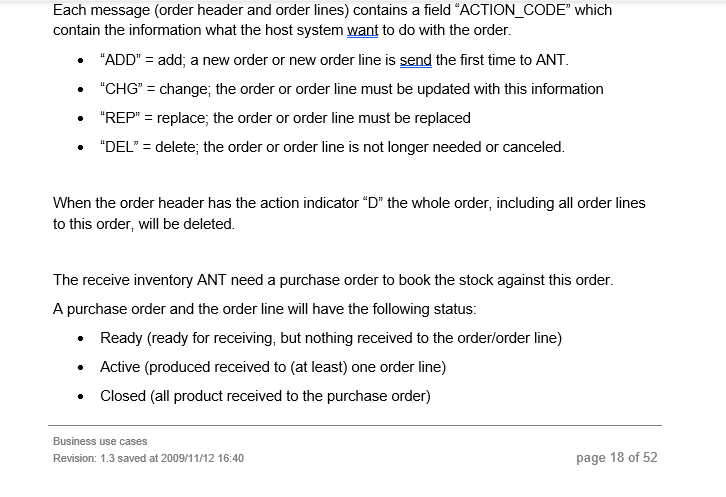
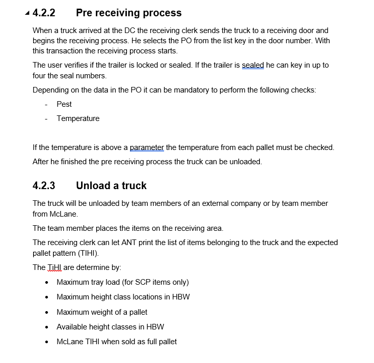
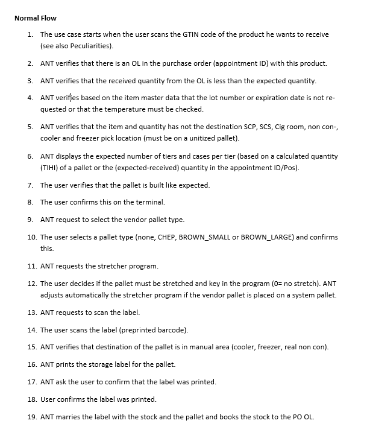

# [ANT](/ANTWIKI.md)>Receiving(Process)

(also see [Receiving(Area)](/Areas/Receiving/Receiving.md))

The **Receiving** process processes and stores stock from trailers at the [Receiving](/Areas/Receiving/Receiving.md) Area into the rest of the warehouse, but mostly into HBW.

## **Related Terms**

| **Term** | **Definition** |
|------|------------|
|*Appointment* | Used for tracking a trucks scheduled time and Assigned door.  Acts as a parent to *Receiving Order*.|
|*Receiving Order* | Links to a **Purchase Order** (external).  Acts as a parent to Receiving Order Line. |
| *Receiving Order Line* | Represents an amount of material with the same **item_id** and **pick** unit combination. |
|*item*| material|
|*Pick Unit*| A type of either Case or Pallet?|
|*Stock*| An amount of an item/material associated to one load unit|

---
## **Breakdown**
Each **trailer** has an **Appointment ID** that breaks down into one or more **PurchaseOrders (PO)'s** (usually one).  
The **PO's** are represented by **Receiving Orders** which act as a parent to **Receiving Order Lines**. 
**Receiving Order Lines** then represent a single **Picking Unit** and **Item ID** combination.

**Stock** arriving with the same **Item ID** and **Picking Unit Type** will share a **ROL** (Two pallets of the same item will share a **ROL**).

---
## **Statuses**
Statuses are used to track the progress of an appointment. The Receiving Statuses are first recorded in the RO's.

1.	New – Data has been received from Retalix.
2.	Assigned – The operator assigns a door to the Appointment ID.
3.	Planned – Stage that the pallets have been created; items are maintained and ready to be received. 
4.	Started – Receiving operators start scanning the pallets/case items.
5.	Finished – Each line item (ROL,COL) changes to Finished status once the operator completes receiving the item. 
6.	Closed – When the load is closed, it does not show in ANT.
---

## **Receiving Status + Process Flow**

### **Host Communication (before appointment exists)(needs work)**
Host sends the data through MQ as POHDR and PODTL to the onsite database.

After a buyer accepts a Purchase Orders the Purchase Order is sent to ANT. After the PU(what is PU in "4.1 buisness use cases.doc?" it's short for the purchase order header to ANT PU_ORDER) order is sent to Ant the order can be updated or canceled. A purchase order will also be sent to ANT when another DC sends product to this DC (unimportant detail)

The host sytem snd the purchase order to the ANT system. A purchase order is split in two parts.
- Order header (POHDR)
- Order lines (PODTL)

TO each purchase order belongs one message for the header (POHDR) and one or more messages for the order lines (PODTL).

Each of these messages, telegrams?, contain an ACTION_CODE which contain the information about what the host system want to do with the order. These aciton codes are..
- "ADD" = add; a new order to new order line is send the first time to ANT.
- "CHG" = change; the order or order line must be updated with this information.
- "REP" = replace; the order or order line must be replaced.
- "DEL" = delte; the order or order line is not longer needed or canceled.
When the order header has the action indicator "D" the whole order, including order lines, will be deleted.
(see example telegrams in hostsendTelegrams. Find what table telegrams are proccessed in. What would it look like if we didn't get a telgram here, does that ever happen?)
there are some statuses that look linked to the telegam.
buisness use cases also talks about some statuses linked to the purchase order that i can't find. i thought they were linked to the telegrams. (here's what i'm looking at)

find where this info goes

### **New**
RO's and ROl's are created
The Appointment ID is linked to the Receiving Order whose status begins with new.
The Receiving Order is also linked to the Receiving Order Lines which show the item and amount that should be received. 

### **Assigned**
When a truck arrives the receiving office should update the status
of the appointment ID(start the appointment ID), so that the RF
operator does not need to scroll through all appointment ID's.

The receiving clerks assign an appointment gate to the Appointment ID which changes the appointment status to 'Assigned'.
- Gate 31 is the grocery dock.
- Gate 10 is the cooler/freezer dock.
### **Planned**
Once the ROL’s are in ‘Assigned’ status, Ant can run the planning process
through WMSReceiving(creates unloading list) and puts the appointment into ‘Planned’ status automatically.
        
- The appointment ID of a PO can be changed up until pallet building.

- process will fail if there are missing item info, wrong gat, or un-updated LU Type Location.
        Process also needs TI/HI, Hazardous, Size/Weight tolerance, free locations.

The planning process, WMSReceiving, creates the Consolidation Order (CO) and links it to the RO.
It also creates the Consolidation order line and links it to the ROL.

Once the PO is planned the CO decides how many pallets are needed to induct the item.
The Receivers can start receiving the item after the item reaches the ‘Planned’ status.

- This process updates wmsOrder and wmsOrderline tables.
- mixed pallets(needs work here)
### **Started**

A worker with a RF terminal receives a pallet when he identifies the item (scans the GTIN code) and confirms the quantity (less ), TIHI, etc. After he has done this, he has clearly to mark the pallet as “re-ceived” by applying the generic barcode, so that in the second step a forklift can pick up the pallet and transport the pallet to the next destination. 
When the DC receives a lot of small loads (less than 1 layer) ANT determines where the locations of the items are and how many items directly go in SCP, SCS, Cig room or a cooler/freezer/non con pick location. Based on the calculation the user has to create unitized pallets for HBW or mixed pal-let, which goes directly to the picking area. 

Found in DOW_07_Receiving_workstation..etc

When the receiver scans the items, the COL’s status changes to ‘Started’.
The RF Operator scans one of the items verifying the material_ID and amount and submits the wrapping flag on the consolidation order.
The operator will scan a sticker from their barcode roll and assign it vendor barcode for the pallet.
(mixed pallets, starting an appointment from rf)

The vendor barcode attaches the load unit to the stock and creates the storage order for the stock items.

When the operator finishes scanning the item the COL changes the status to ‘Finished’.
### **Finished**	
The pallet may be picked up by a forklift and taken to an induction point.

Once the pallet is placed on the induction line, the vendor barcode is scanned.
If the pallet is on a Chep pallet, it will need to go to the Pallet Exchanger
to be exchanged for a system pallet and get the system pallet barcode 
assigned to the load unit.
### **Closed (will see on consolidation orders, rol's will be deleted here)**
The status changes to closed after all the ROL's of a RO are in finished. The appointment is deleted with the receiving order and the receiving order line?

---

## Extra Unorganized INFO 

### Receiving Tables 

Received goods are available for replenishment but are not reserved for shipping (billing) until the corresponding PO is closed and the stock is confirmed to McLane. 

**Before Pallets Can be Accepted**

- Expiration Date
- Temperature Controlled Items
- Damaged Items
- Pest Control
- Quarantine
- Building Pallets

# Links
- [ANT](/ANTWIKI.md)

